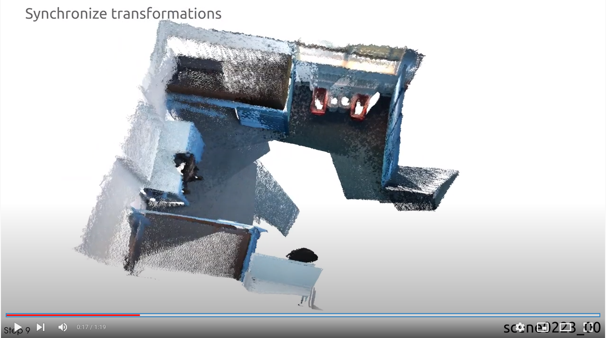

# Learning Iterative Robust Transformation Synchronization

This repository contains the code for
```
@inproceedings{yew2020-RobustSync, 
    title={Learning Iterative Robust Transformation Synchronization}, 
    author={Yew, Zi Jian and Lee, Gim Hee}, 
    booktitle={International Conference on 3D Vision (3DV)},
    year={2021} 
}
```

See the following link for a video demonstration on the ScanNet dataset.

<a href="https://www.youtube.com/watch?v=FpAFXSkVSpY">
    
</a>


## Prerequisites

This code has been tested on PyTorch 1.7.1 (w/ Cuda 10.2) with PyTorch Geometric 1.7.1. Note that our code currently does not support PyTorch Geometric v2. You can install the required packages by running:

```bash
pip install -r requirements.txt
```

Then install torch geometric (and its required packages) by running the following:

```bash
export TORCH=1.7.1
export CUDA=cu102
pip install torch-scatter==2.0.7 -f https://pytorch-geometric.com/whl/torch-${TORCH}+${CUDA}.html
pip install torch-sparse==0.6.9 -f https://pytorch-geometric.com/whl/torch-${TORCH}+${CUDA}.html
pip install torch-cluster==1.5.9 -f https://pytorch-geometric.com/whl/torch-${TORCH}+${CUDA}.html
pip install torch-spline-conv==1.2.1 -f https://pytorch-geometric.com/whl/torch-${TORCH}+${CUDA}.html
pip install torch-geometric==1.7.1
```

If you want to process the ScanNet data yourself, you will also also need to install the following:

* OpenCV (`pip install opencv-python`)
* Open3D (`pip install open3d`)
* nibabel (`pip install nibabel`)
* Minkowski Engine (`pip install MinkowskiEngine==0.4.3`)


## Getting the data

### NeuRoRA Synthetic dataset

For this, you may either use the provided scripts to generate the dataset yourself, or download the dataset:

* <u>Generate data</u>: Run the MATLAB script `src/scripts/NeuRoRA/Example_generate_data_pytourch.m`. The generated data (~7GB) will be stored in `data/neurora/gt_graph_random_large_outliers.h5`.

  Note that due to randomness in the generation scripts, the generated data will not be exactly the same as ours and the evaluation results might differ slightly.

* <u>Download data</u>: Please email me if you need the exact data I used.

### ScanNet

#### Download

We provide the view graphs for our training/validation/test sets [here](https://drive.google.com/file/d/1tSVzfuSfH7pBia1VPepK91mq_481AUq3/view?usp=sharing) (85MB). Place the downloaded data into `data/`.

#### I want to process the data from raw data myself

If you wish to reprocess the raw dataset yourself, follow the following steps for the train/val dataset:

1. First, download the raw datasets from the [ScanNet website](http://www.scan-net.org/). You need the .sens file.
2. Extract the depth images and poses from the .sens file, e.g. using the [SensReader](https://github.com/ScanNet/ScanNet/tree/master/SensReader/c++).
3. Downloaded the pretrained models for FCGF, and pairwise registration block of LMPR, and place them in 
4. Run the script `src/data_procesing/process_scannet.py` to generate the training/validation dataset.

For the test dataset, you may contact the authors of LMPR to get the point clouds used, after which you can run step 4 above to generate the view graphs. Note that the relative poses will differ slightly from those reported in their/our paper due to randomness (e.g. from RANSAC).

### 3DMatch

We provide the view graphs for training [here](https://drive.google.com/file/d/1LIN7uXwRA7-tyrJGLRqEzi5aNUrItbEX/view?usp=sharing). Place the downloaded data into `data/`.

Alternatively, you may process the data yourself by running the script `src/data_processing/process_3dmatch.py` on the 3DMatch dataset downloaded from [LMPR project page](https://github.com/zgojcic/3D_multiview_reg).


## Pre-trained checkpoints

Our pretrained checkpoints are found in this repository under  `src/ckpt/`:

| Checkpoint  | Description                                                  |
| ----------- | ------------------------------------------------------------ |
| neurora.pth | Checkpoint for NeuRoRA synthetic dataset (Table 1 in paper)  |
| scannet.pth | Checkpoint trained on ScanNet dataset (Table 3, row 6 in paper) |
| 3dmatch.pth | Checkpoint trained on 3DMatch dataset (Table 3, row 5 in paper) |


## Evaluation

### NeuRoRA Dataset

Run the following to evaluate our pretrained model (change the `--resume` argument accordingly if you're using your own trained model):

```bash
cd src
python inference_graphs.py --dev --dataset neurora --hidden_dim 64 --val_batch_size 1 --resume ckpt/neurora.pth
```

The metrics will be printed at the end of inference, and the predicted absolute rotations are also saved in `logdev/computed_transforms/output_transforms.h5`. Note that the metrics might differ slightly if you are using your own generated data. 

Also, since our evaluation implementation might differ from the official MATLAB ones, it is recommended that you rerun the evaluation on the predicted transforms by following the next step.

**Evaluation using official MATLAB scripts.**    We also provide the functionality to evaluate the predicted rotations using the MATLAB scripts from NeuRoRA, which we provide at `src/scripts/NeuRoRA/test_synthetic.m` (change the path at L6 accordingly if incorrect).

### ScanNet Dataset

Run the following to evaluate our pretrained model. As before, change the `--resume` argument accordingly if you're using your own trained model:

```bash
cd src
python inference_graphs.py --dev --dataset scannet --resume ckpt/scannet.pth
```

The metrics will be printed at the end of inference.


## Training

### NeuRoRA Dataset
We use a smaller network for rotation averaging, compared to the other experiments on rigid-motion synchronization.

```bash
cd src
python train_graph.py --dataset neurora --hidden_dim 64 --train_batch_size 1 --val_batch_size 2
```

The performance should saturate around 1.6-1.7 deg mean rotation error during validation.

### ScanNet/3DMatch Dataset

For our experiments, we tried two settings:

1. Train using ScanNet dataset:
    ```bash
    cd src
    python train_graph.py --dataset scannet
    ```

2. Train using 3DMatch dataset (direct generalisation test):

   ```bash
   cd src
   python train_graph.py --dataset 3dmatch
   ```
